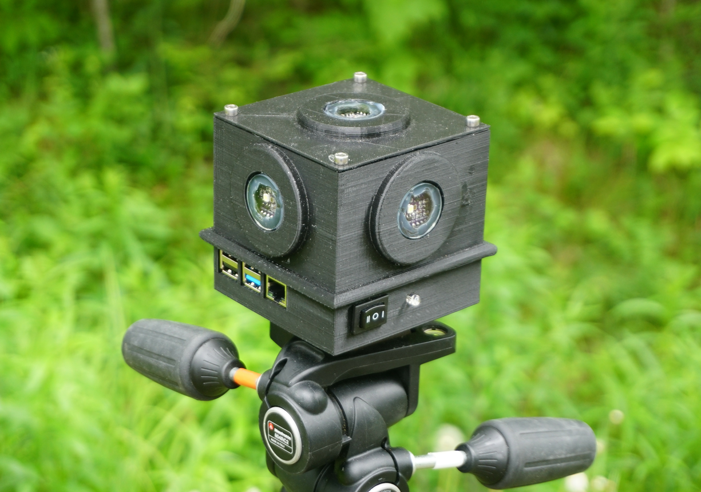

# Lancube


LANcube instrument software



## Getting started with the Lancube
* Build your own lancube: [guide](https://lx02.cegepsherbrooke.qc.ca/~aubema/index.php/Prof/LAN3v2-technical).
* Install the software system on a physical Lancube please refer to this [guide](https://lx02.cegepsherbrooke.qc.ca/~aubema/index.php/Prof/LAN3v2-technical).


## Generate discrete lights inventory from the Lancube
The script ```lancube_inventory.py``` generates a discrete light source inventory from the data scanned.
It will automatically correct aberrant and imprecise data by looking at the following elements:
  * Disconnection from the GPS
  * Sensors with overexpose values
  * Distance between two measures
  * Distance with the roads

#### Inventory output
During execution the file ```lan3_inventory.csv``` will be created in your execution folder.
It provides the following lamps characteristic:
   * GPS coordinates: (lat, lon)
   * H: Light heigth
   * h: Lancube heigth
   * D: Distance with prime
   * d: Distance from light
   * Lights technologie
   * RGB + clear data


For further details on the script execution and the calculations performs, please refer to this paper: xxx


### Support
For any question please refer to this guide: https://lx02.cegepsherbrooke.qc.ca/~aubema/index.php/Prof/Page
